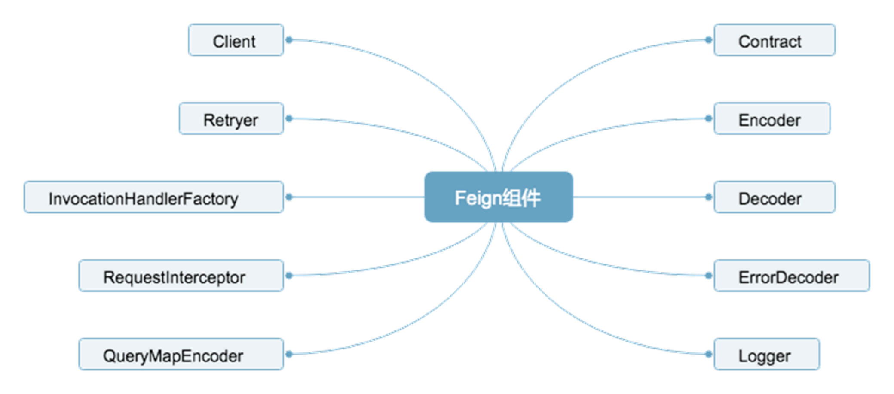
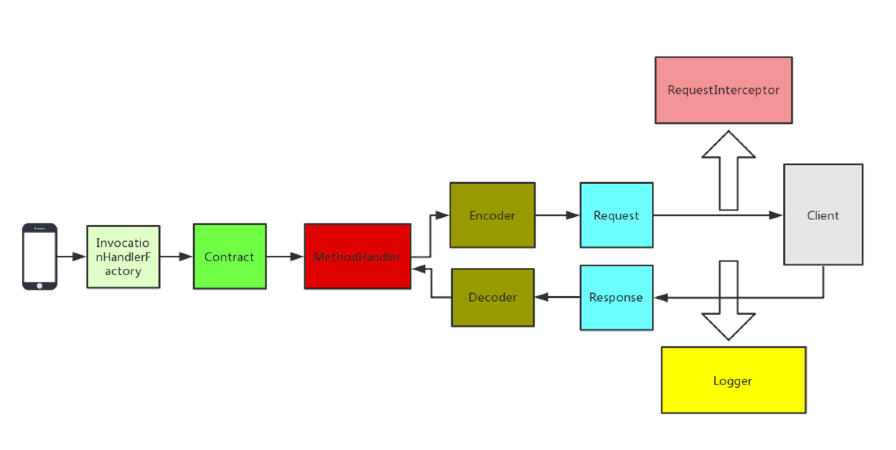

== Feign 基础知识

:sourcedir: ../chapter12/src/main/java/com/huijz/lagou/chapter12

====
在日常工作中，我们经常会遇到需要调用内部 API 或者第三方 API 的情况，主要有以下方式：

HttpURLConnection

HttpClient

OKHttp

RestTemplate

以上这四种是我们最常见的 API 调用方式，在调用 API 之前，我们首先需要知道 API 的地址，其次是 API 对应的参数，然后发起调用，本质上调用 API 的过程就是一个 HTTP 请求过程。

====

=== 1.Feign 简介

     Feign 是一个声明式的 REST 客户端，它的目的就是让 REST 调用更加简单。Feign 提供了 HTTP 请求的模板，通过编写简单的接口和插入注解，就可以定义好 HTTP 请求的参数、格式、地址等信息。

   而且 Feign 会完全代理 HTTP 请求，我们只需要像调用方法一样调用它就可以完成服务请求及相关处理。Spring Cloud 对 Feign 进行了封装，使其支持 SpringMVC 标准注解和 HttpMessageConverters。Feign 可以与 Eureka 和 Ribbon 组合使用以支持负载均衡，与 Hystrix 组合使用，支持熔断回退。

    如果你没有使用 Spring Cloud，那么可以直接用原生的 Feign 来调用 API，如果你使用了 Spring Cloud，可以直接用 Spring Cloud OpenFeign 来调用 API。

=== 2.Feign 重要组件

====
Feign 有如此强大的功能，离不开内部众多组件的支持，这些组件同时也为 Feign 提供了非常灵活的扩展机制，我们可以根据自身的需求去扩展这些组件，下面我们讲解 Feign 中的重要组件。
====

.. Contract 契约组件:

 在 Feign 中可以通过定义 API 接口的方式来调用远程的 Http API，在定义调用 Client 的时候需要增加一些注解来描述这个调用 API 的基本信息，比如请求类型是 GET 还是 POST，请求的 URI 是什么。Contract 允许用户自定义契约去解析注解信息，最典型的应用场景就是在 Spring Cloud 中使用 Feign，我们可以使用 Spring MVC 的注解来定义 Feign 的客户端，这是因为 Spring Cloud OpenFeign 中实现了自己的 SpringMvcContract。

.. Encoder 编码组件:

 通过该组件我们可以将请求信息采用指定的编码方式进行编码后传输。

.. Decoder 解码组件:

 Decoder 将相应数据解码成对象。

.. ErrorDecoder 异常解码器

 当被调用方发生异常后，我们可以在 ErrorDecoder 中将响应的数据转换成具体的异常返回给调用方，适合内部服务之间调用，但不想通过指定的字段来判断是否成功的场景，直接用自定义异常代替。

.. Logger 日志记录:

     Logger 组件是负责 Feign 中记录日志的，可以指定 Logger 的级别以及自定义日志的输出。

.. Client 请求执行组件:

 Client 是负责 HTTP 请求执行的组件，Feign 将请求信息封装好后会交由 Client 来执行，Feign 中默认的 Client 是通过 JDK 的 HttpURLConnection 来发起请求的，在每次发送请求的时候，都会创建新的 HttpURLConnection 链接，使用默认的方式，Feign 的性能会很差，原因就是使用了 HttpURLConnection。你可以通过扩展该接口，使用 Apache HttpClient 等基于连接池的高性能 HTTP 客户端。

.. Retryer 重试组件:

 Retryer 是负责重试的组件，Feign 内置了重试器，当 HTTP 请求出现 IO 异常时，Feign 会限定一个最大重试次数来进行重试操作。

.. InvocationHandlerFactory 代理:

  InvocationHandlerFactory 采用 JDK 的动态代理方式生成代理对象，我们定义的 Feign Client 是接口，当我们调用这个接口中定义的方法时，实际上是要去调用远程的 HTTP API，这里用了动态代理方式，当调用某个方法时，会进入代理中真正的去调用远程 HTTP API。

.. RequestInterceptor 请求拦截器

 可以为 Feign 添加多个拦截器，在请求执行前设置一些扩展的参数信息。

.. QueryMapEncoder 参数查询:

 QueryMapEncoder 是针对实体类参数查询的编码器，可以基于 QueryMapEncoder 将实体类生成对应的查询参数。

=== 3.Feign 执行过程

  在使用 feign 时，我们会定义对应的接口类，在接口类上使用 Feign 自带的注解来标识 HTTP 的请求参数信息，当调用接口对应的方法时，Feign 内部会基于面向接口的动态代理方式生成实现类，将请求调用委托到动态代理实现类，负责动态代理的组件是 InvocationHandlerFactory。

  根据 Contract 规则，解析接口类的注解信息，翻译成 Feign 内部能识别的信息。Feign 默认有一套自己的协议规范，我们也可以自定义其他的规范来进行扩展，在 Spring Cloud OpenFeign中就扩展了 SpringMvcContract，这样做的目的是为了降低学习和使用成本，客户端和服务端使用同一个接口定义，发布成 SDK 给调用方使用。

  MethodHandler 在执行的时候会生成 Request 对象，在构建 Request 对象的时候会为其设置拦截器，交由 Client 执行前记录一些日志，Client 执行完成后也记录一些日志，然后使 Decoder 进行相应结果的解码操作，并返回结果。

=== 4.Feign 的使用

[source,java,indent=0]
----
include::{sourcedir}/client/UserRemoteClient.java[lines=14..18]
----

